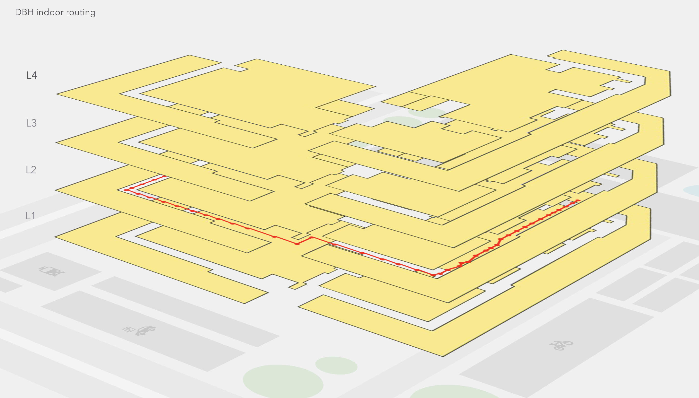
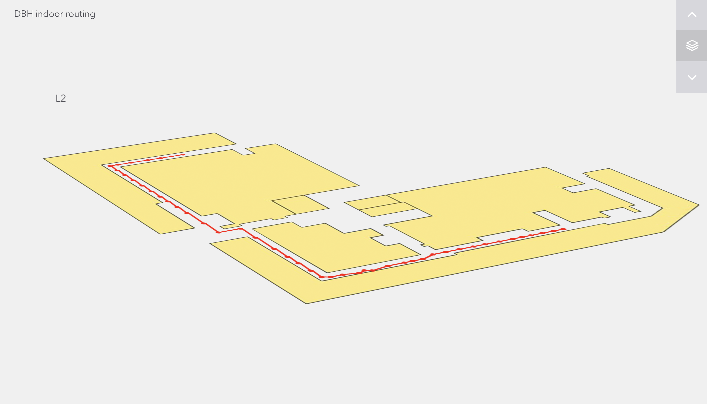
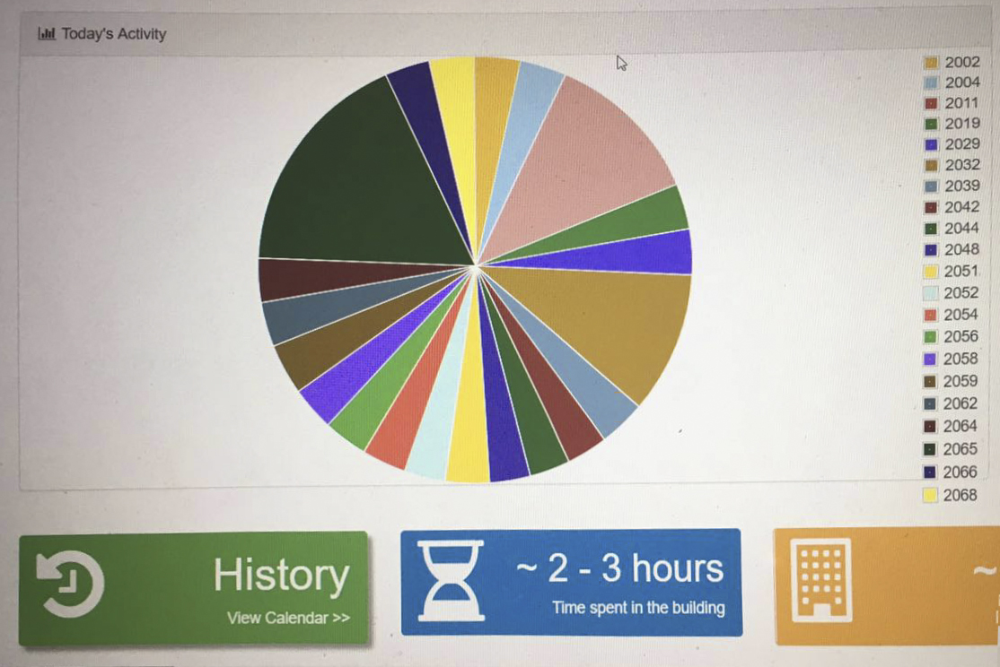
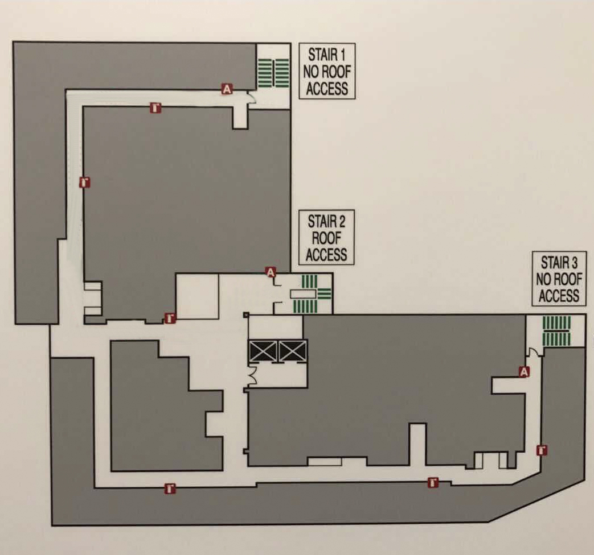
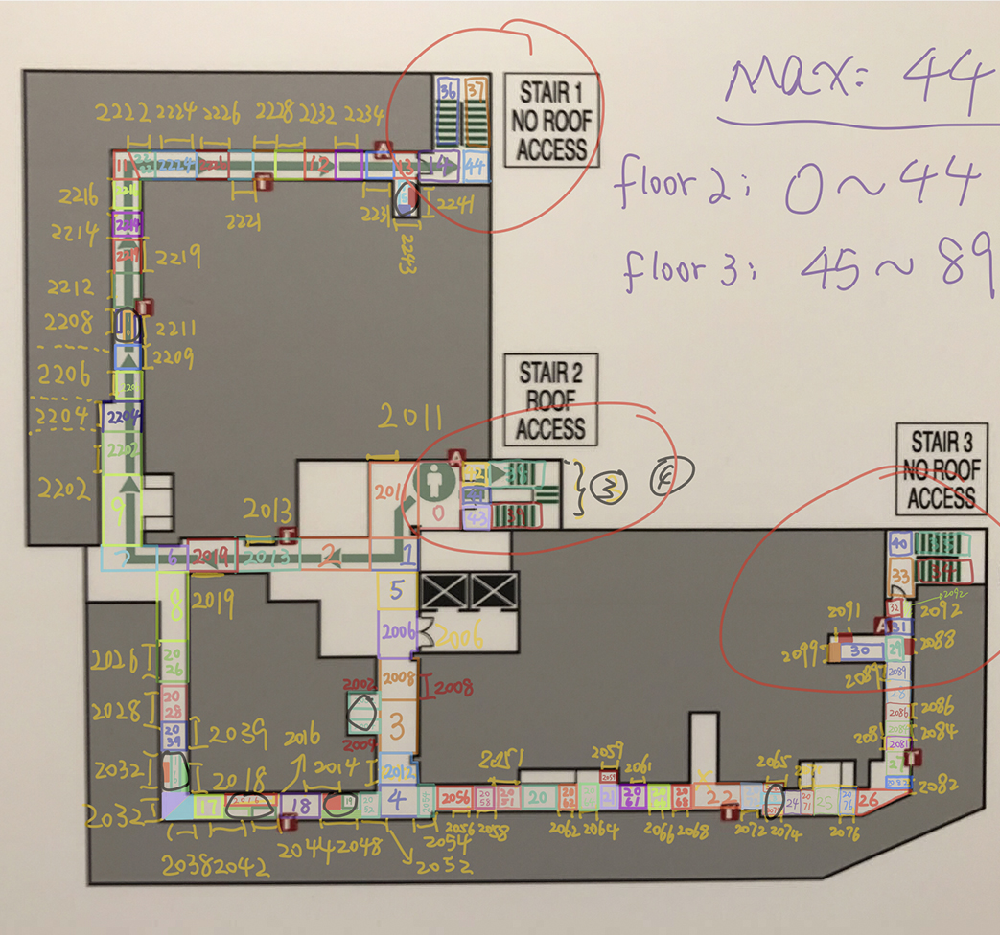
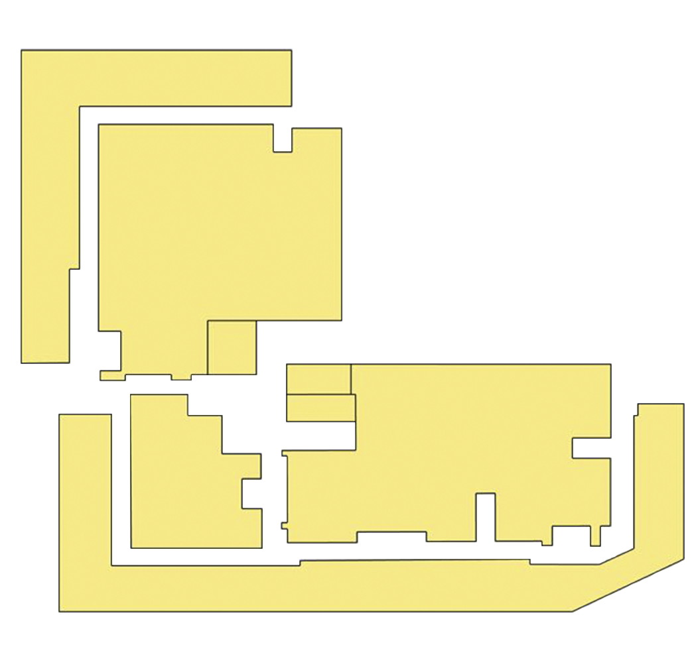

# DBHIndoorRouter

1. Suggested destinations among multi-floors in DBH Building sorted by distance based on user's input prefix.
2. Displayed shortest routes from user's location to destination (eg. same floor, different floor through elevator etc.) within canvas using Dijkstra (also do research on A*). 
Eg. Find the nearest exit, nearest restroom from user's current location.
3. Implemented modularize IoT based services calculating routes through tracking interaction between user's phone and sensors(beacons/wifi routers) installed in the building and obtaining data from interfaces applied by Tippers.

# Overview
### Tech
1. Built responsive layout available both for PC and mobile with jQuery, javascript.
2. Implemented back-end services with Guice for dependency injection.
3. Database with MySQL for mapping information storage.

### Page Display
Routing from source to destination:

One layer detail:

In addition, we implemented routing between different layer and its corresponding display.

### Data source
We get user's statistical indoor location from beacon interface in [Tippers](http://tippersweb.ics.uci.edu/):

And obtain the latest one among them.

# Before Running:
Mark "src/main/webapp/resources" directory as "Resource Root"
Create a database named "cs237", and populate data from 'cs237.sql' in 'src/main/webapp/resources/'

### beacon
return "beacon_placement.json" String service
### common
Common utilization
### DBHmap
Read from "DBH 2 floor.txt" to retrieve the neighbor-cost map (TYPE : Map<String, Map<String, Double>>) for routing.
### localize
RoomNo-description pairs Object
### routing
Calculate the nearest route based on DBH map and start point and destination room No obtained from front-end.
### coordinates
Read from "coordinates.txt" to get roomNo->coordinate map (TYPE : Map<String, Coordinate>) for transferring.

# Test
RoomNoCoordinatesReaderTest.java : test coordinates module
DBHMapReaderTest.java : test DBHmap module
RouterServiceTest.java : test routing module

# Model
First we got the original single floor map of CS Department Hall (Donald Bren Hall):

And we divided the path into multiple block and define distance between blocks:

In the meantime, we draw the map of single floor using third party software:

# TODO:
1. show start and destination icon in front-end.
